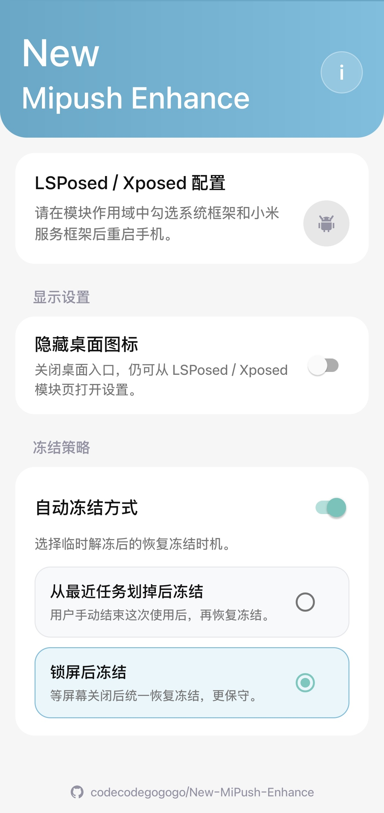

# New Mipush Enhance

一个用于增强被冻结应用的小米推送通知体验的 Xposed / LSPosed 模块。

**本项目地址：[https://github.com/codecodegogogo/New-MiPush-Enhance](https://github.com/codecodegogogo/New-MiPush-Enhance)**

---

forked from vivian8421/MiPush-Enhance

## 一、功能

- 在被冻结应用收到 MIPush 通知后，点击通知时自动解冻目标应用。

- 解冻后重新触发原通知的 PendingIntent，打开通知对应界面。

- 提供模块设置页，可隐藏桌面图标。

- 提供冻结策略：1.无后台自动清理 2.锁屏自动清理。

- 软件界面：

  

## 二、使用

在 LSPosed / Xposed 中启用模块后，请在模块作用域中勾选：

- 系统框架
- 小米服务框架

**设置完成后重启手机。**

## 三、重要说明

**1.本软件测试环境为xiaomi14 hyperos3 android16 雹-root停用模式**

理论上停用模式可以使用，其他的模式不行。（未适配）

**2.被冻结的应用必须支持mipush才可以适应本模块**
例如：微信 哔哩哔哩国际版未接入mipush，所以使用本模块也不会让他受到通知。

## **四.两种冻结策略**

**1. 划掉后台后冻结**

触发条件是：**用户把这个应用从最近任务里划掉**，系统触发 Task.removedFromRecents/removeTask 之类事件。

不会冻结的情况：

- 自动冻结总开关没开。
- 当前策略不是“划掉后台后冻结”。
- **这个应用不是本模块临时解冻记录过的应用。**
- 系统任务里解析不到对应包名，或者 userId 对不上。
- **这个应用还在最近任务里，没有被划掉。**也就是说：只是退到后台、还在多任务列表里，不会冻结。
- 系统调用停用失败，比如权限、系统限制、包管理接口异常。

**2. 锁屏后冻结**

触发条件是：系统进入灭屏/锁屏状态，比如 interactive=false 或 ACTION_SCREEN_OFF。

不会冻结的情况：

- 自动冻结总开关没开。

- 当前策略不是“锁屏后冻结”。

- **应用不是本模块临时解冻记录过的应用。**

- 锁屏 hook 没命中，也就是系统没有走到我们监听的锁屏触发点。

  

## **五、原理介绍**

本模块面向使用 root 停用类冻结方式的场景。被冻结的应用通常无法直接响应通知点击，因此模块会在系统层监听 MIPush 通知点击流程。

当用户点击一条来自小米推送的通知时，模块会先判断目标应用是否处于停用/冻结状态。如果是，就临时将目标应用恢复为可用状态，并清除 stopped 状态，让系统能够继续把通知点击事件交给目标应用。

在部分 Android / HyperOS 版本上，仅解冻应用还不够，通知对应页面可能仍会被后台启动限制拦截。因此模块还会尝试重新触发原通知的 PendingIntent，并在必要时从系统侧补发启动请求，使目标应用尽量打开到通知对应页面。

自动冻结功能只处理由本模块临时解冻过的应用。用户可以选择在“从最近任务划掉后冻结”或“锁屏后冻结”时，将这些应用重新恢复为停用状态，避免应用长期留在后台运行。

